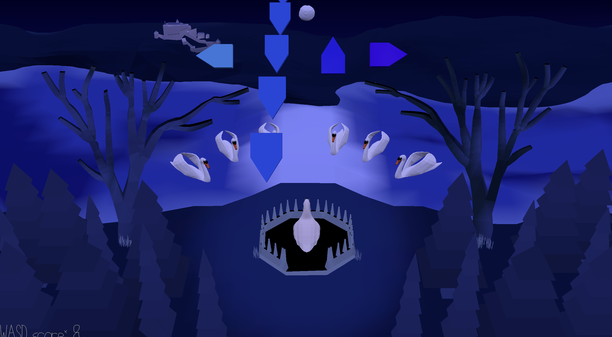

# Swan Song

Author: Sarah Di (sarahdi)

Design: My game is a rhythm game with a plot. You are a duck raised by swans (the ugly cygnet). Eager to
please the swan heads, you plan to sing at the annual talent show. Can you hit the notes or fall flat!

Music:
I created the music using the Bosca Ceoil DAW with inspriation from the Swan Lake theme (Tchaikovsky), which is in
the public domain since it was made in the 1870s. I applied melodic inversion to make the song have the same characteristics
as the original theme but to give it a more spooky feeling.

I created the background music in garageband in the same key as the swan lake theme.

Quacks are also recorded by me.

Screen Shot:

How To Play:

WASD to move around. Arrow Keys for rhythm game motion.
To activate the music, stay on the podium for 3 seconds. thx.
If you're wondering the song is 1:12.

This game was built with [NEST](NEST.md).
